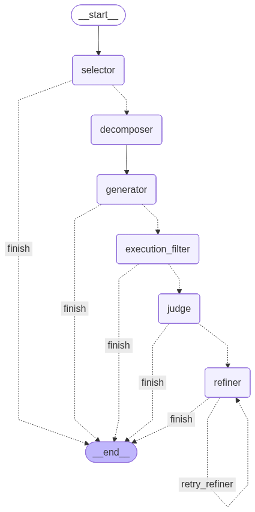

# text-to-sql-hse26
 Master's thesis that tries to solve text-to-sql problem by applying modern approaches

## Documentation

- [baseline.md](baseline.md) — архитектура агента (schema linking, SQL generator, pipeline) и описание компонентов системы
- [results.md](results.md) — ход экспериментов, результаты оценки на Spider dev set, анализ ошибок и выводы 

## Installation
1. Clone repository. For example
```commandline
git clone git@github.com:vakhibin/text-to-sql-hse26.git
```

2.  We manage environments and dependencies with UV. That's why one need to install UV first.

2. Install virtual environment and dependencies.
```commandline
uv venv 
uv sync
```


## Архитектура текущего агента

### Обзор

Агент представляет собой **многоэтапный text-to-SQL пайплайн**, оркестрируемый [LangGraph](https://github.com/langchain-ai/langgraph). На вход подаётся вопрос на естественном языке и идентификатор базы данных, на выходе -- исполняемый SQL-запрос, полученный через шесть последовательных стадий с условной маршрутизацией и ранним выходом при критических ошибках.

Все вызовы LLM проходят через [OpenRouter](https://openrouter.ai) -- единый API-шлюз к нескольким провайдерам моделей.

### Обоснование архитектурных решений

В основу архитектуры легли три работы:

1. **MAC-SQL** (COLING 2025, [arXiv 2312.11242](https://arxiv.org/abs/2312.11242)) -- отсюда взята трёхкомпонентная структура агента: Selector -> Decomposer -> Refiner. MAC-SQL даёт 59.59% EX на BIRD и служит базовым скелетом нашего пайплайна. Мы сохранили идею декомпозиции сложных вопросов на подвопросы с классификацией сложности (simple/moderate/complex) и итеративной самокоррекции SQL по тексту ошибки исполнения (до 3 попыток).

2. **CHASE-SQL** (Google, ICLR 2025, [arXiv 2410.01943](https://arxiv.org/abs/2410.01943)) -- отсюда идея генерации нескольких SQL-кандидатов и использования LLM-as-Judge для выбора лучшего. Вместо одной попытки генерации мы создаём ансамбль из N кандидатов, фильтруем невалидные через исполнение, а затем независимая LLM (Judge) выбирает лучший с обоснованием.

3. **XiYan-SQL** (Alibaba, [arXiv 2411.08599](https://arxiv.org/abs/2411.08599)) -- отсюда идея мультимодельного ансамбля: кандидаты генерируются не одной моделью, а несколькими (primary + secondary) с разными температурами и few-shot примерами, что увеличивает разнообразие и покрытие. XiYan-SQL даёт 72.23% EX на BIRD dev.

**Ключевая идея**: взять структуру декомпозиции и самокоррекции из MAC-SQL и усилить её ансамблевой генерацией в духе CHASE-SQL/XiYan-SQL, запустив генерацию асинхронно на нескольких моделях через единый API-шлюз (OpenRouter). Между генерацией и судейством добавлена стадия фильтрации по исполнению (Execution Filter), которая отсеивает синтаксически и семантически ошибочные кандидаты до того, как Judge их увидит.

### Стадии пайплайна



| Стадия | Описание |
|---|---|
| **Selector** | Векторный поиск (ChromaDB) + LLM-реранкер -> 3-5 релевантных таблиц |
| **Decomposer** | Классификация сложности + генерация подвопросов (CoT) |
| **Generator** | Ансамбль: N кандидатов асинхронно (primary + secondary модели, разнообразные few-shot) |
| **Exec Filter** | Валидация через SQLAlchemy -> отсев невалидных кандидатов |
| **Judge** | LLM-as-Judge -> выбор лучшего кандидата с обоснованием |
| **Refiner** | Исполнение -> при ошибке самокоррекция (макс. 3 итерации) |

**Условная маршрутизация**: каждая стадия может инициировать ранний выход при критическом сбое (например, схема не найдена, кандидаты не сгенерированы). Refiner зацикливается на себя до `MAX_REFINE_ATTEMPTS` раз.

### Политика моделей

| Роль | Модель | Назначение |
|---|---|---|
| Основной генератор | `google/gemini-2.5-pro` | Генерация SQL (5 из 8 кандидатов) |
| Дополнительный генератор | `deepseek/deepseek-chat-v3` | Разнообразие в ансамбле (3 из 8 кандидатов) |
| Судья | `openai/gpt-4.1` | Выбор лучшего кандидата |
| Эмбеддинги | `openai/text-embedding-3-large` | Векторный поиск по схеме |
| Реранкер селектора | Основной генератор | Переранжирование таблиц |
| Декомпозер | Основной генератор | Анализ вопроса |
| Рефайнер | Основной генератор | Исправление SQL по ошибке |

### Ключевые технические решения

- **LangGraph для оркестрации** -- обеспечивает типизированное состояние, условные рёбра и компилируемый граф, удобный для визуализации и отладки. Предпочтён raw asyncio-цепочкам ради поддерживаемости.
- **ChromaDB для индексации схемы** -- легковесное встраиваемое векторное хранилище. Каждая таблица индексируется как документ с колонками, примерами значений, первичными/внешними ключами. Персистентное хранение на диске (`.cache/chroma`).
- **Формат mSchema** -- компактное текстовое представление схемы, передаваемое генераторам. Включает имена таблиц, имена/типы колонок, примеры значений и связи по внешним ключам.
- **Few-shot из train-сплита Spider** -- примеры сэмплируются для каждого кандидата с детерминированными seed'ами для воспроизводимости. Приоритет отдаётся примерам из той же БД.
- **Retry-политика через Tenacity** -- все вызовы LLM обёрнуты экспоненциальным backoff'ом (3 попытки, ожидание 1-8 сек) для обработки сбоев API.
- **Асинхронность повсюду** -- вызовы LLM, исполнение SQL, загрузка схемы -- всё через `asyncio`. Скрипт оценки поддерживает `--concurrency N` для параллельной обработки примеров.

### Структура проекта

```
text_to_sql_agent/
  agents/           # Реализация стадий пайплайна
    selector.py       Schema linking (векторный поиск + LLM-реранкинг)
    decomposer.py     Классификация сложности вопроса + декомпозиция
    generator.py      Ансамблевая генерация SQL (N кандидатов, async)
    execution_filter.py  Валидация SQL через SQLAlchemy
    judge.py          LLM-as-Judge отбор кандидатов
    refiner.py        Итеративная самокоррекция
  graph/            # Оркестрация LangGraph
    state.py          Контракт общего состояния (SQLAgentState TypedDict)
    pipeline.py       Связывание графа и условная маршрутизация
  tools/            # Общие утилиты
    llm_router.py     Централизованный LLM-клиент с маршрутизацией моделей и retry
    sql_executor.py   Асинхронное исполнение SQL (SQLAlchemy + aiosqlite)
    schema_loader.py  Парсинг схемы Spider и форматирование в mSchema
    vector_store.py   Клиент индексации/поиска ChromaDB
    few_shot.py       Пул few-shot примеров и сэмплирование
  prompts/          # Шаблоны промптов для каждой стадии
  evaluation/       # Скрипты бенчмарков (Spider v1, BIRD, Spider v2)
  config.py         # Конфигурация через Pydantic-settings (.env)
  main.py           # CLI точка входа для одиночного запроса
```

# Текущие результаты
TODO
