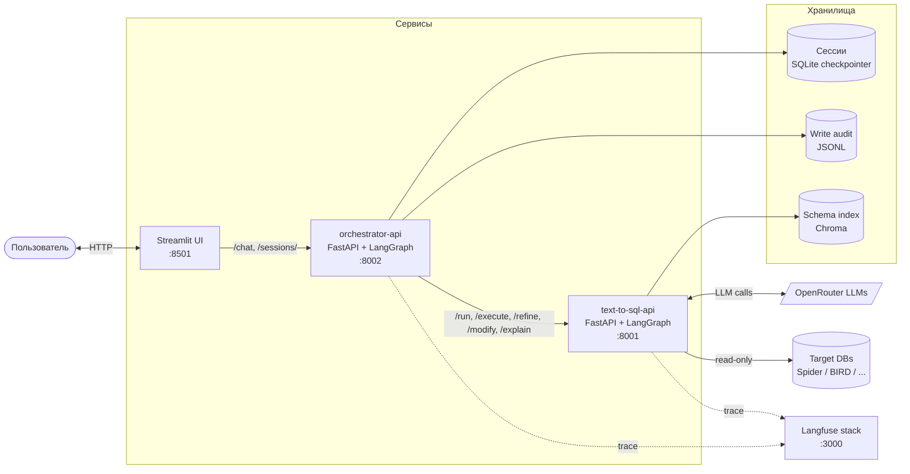
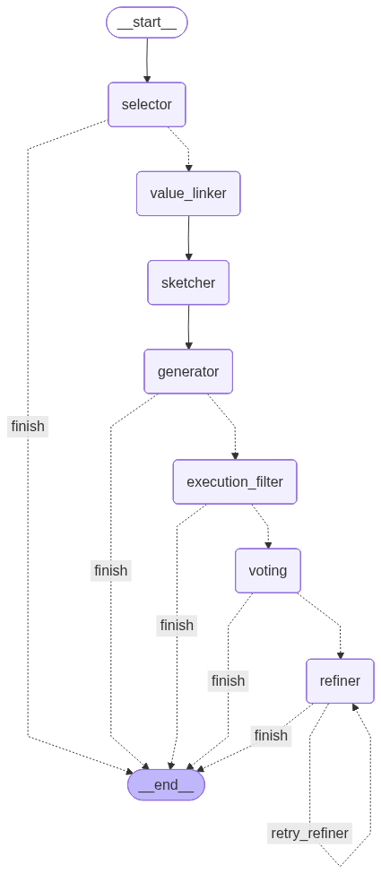

# text-to-sql-hse26

Магистерская работа: разговорный сервис, который превращает вопросы на естественном языке в SQL-запросы и исполняет их над пользовательской базой. Под капотом — ансамблевый Text-to-SQL агент в духе MAC-SQL / CHASE-SQL / XiYan-SQL, агент-оркестратор поверх него с памятью сессии и тулзами, и Streamlit-воркбенч в качестве UI.

---

## Что внутри

Система состоит из двух автономных агентов и сервис-обвязки вокруг них:

| Компонент | Что делает |
|---|---|
| **`text_to_sql_agent/`** | Research-ядро: многоэтапный LangGraph-пайплайн, который из вопроса + `db_id` производит исполняемый SQL. Используется напрямую в бенчмарках и через HTTP-обёртку. |
| **`orchestrator_agent/`** | Разговорный LangGraph-агент: ведёт диалог, помнит сессию, вызывает тулзы (полный пайплайн, исполнение SQL, объяснение, рерайт, история, write-guardrails). |
| **`services/text_to_sql_api/`** | Тонкая FastAPI-обёртка над `text_to_sql_agent`. |
| **`services/orchestrator_api/`** | FastAPI + LangGraph-сервис над `orchestrator_agent`. |
| **`services/ui/`** | Streamlit-воркбенч (чат + SQL-редактор + просмотр результата + inspector прогона). |
| **Langfuse-стек** | Поднимается в том же `docker-compose`: трассировка стадий пайплайна, токены, стоимость, latency. |

Подробности — в [`docs/SERVICE_ARCHITECTURE.md`](docs/SERVICE_ARCHITECTURE.md) (сервисный слой) и [`docs/ARCHITECTURE.md`](docs/ARCHITECTURE.md) (research-ядро).

---

## Архитектура (высокоуровнево)


```mermaid
flowchart LR
    User([Пользователь])

    subgraph Apps[Сервисы]
        UI["Streamlit UI<br/>:8501"]
        Orch["orchestrator-api<br/>FastAPI + LangGraph<br/>:8002"]
        T2S["text-to-sql-api<br/>FastAPI + LangGraph<br/>:8001"]
    end

    LLM[/OpenRouter LLMs/]

    subgraph Data[Хранилища]
        Sess[("Сессии<br/>SQLite checkpointer")]
        Audit[("Write audit<br/>JSONL")]
        Chroma[("Schema index<br/>Chroma")]
    end

    DBs[("Target DBs<br/>Spider / BIRD / ...")]
    Obs["Langfuse stack<br/>:3000"]

    User <-->|HTTP| UI
    UI -->|/chat, /sessions/| Orch
    Orch -->|/run, /execute, /refine, /modify, /explain| T2S
    T2S <-->|LLM calls| LLM
    Orch --> Sess
    Orch --> Audit
    T2S --> Chroma
    T2S -->|read-only| DBs
    Orch -. trace .-> Obs
    T2S -. trace .-> Obs
```

Подробная диаграмма со связями и последовательностью обработки запроса — в [`docs/CHAPTER_3_DIAGRAM.md`](docs/CHAPTER_3_DIAGRAM.md).

---

## Быстрый старт через Docker Compose

Это рекомендуемый путь — поднимает все сервисы вместе с локальным Langfuse-стеком одним движением.

```bash
# 1. Конфиг
cp .env.compose.example .env
# отредактируй OPENROUTER_API_KEY (обязательно)
# при необходимости поменяй модели и LANGFUSE_* (есть дефолты для локального dev)

# 2. Данные
# Положи Spider/BIRD под ./databases/spider, ./databases/bird (read-only mount)

# 3. Запуск
make compose-up
# либо: docker compose up --build
```

После старта:

- UI: <http://localhost:8501>
- Orchestrator API: <http://localhost:8002/docs>
- Text-to-SQL API: <http://localhost:8001/docs>
- Langfuse UI: <http://localhost:3000> (дефолтные dev-креды — в `.env.compose.example`)

Полезные команды:

```bash
make compose-ps      # статус контейнеров
make compose-logs    # tail логов
make compose-test    # pytest внутри text-to-sql-api контейнера
make compose-down    # остановить и снести
```

Health-чек:

```bash
curl http://localhost:8001/health
curl http://localhost:8002/health
```

---

## Локальный запуск без Docker

Удобно для разработки и отладки.

```bash
# 1. Окружение
uv venv
uv sync

# 2. Конфиг
cp .env.example .env
# отредактируй OPENROUTER_API_KEY

# 3. Сервисы (каждый в своём терминале)
uv run uvicorn services.text_to_sql_api.main:app   --port 8001 --reload
uv run uvicorn services.orchestrator_api.main:app  --port 8002 --reload
uv run streamlit run services/ui/app.py
```

Smoke-проверка цепочки `UI → orchestrator → text-to-sql`:

```bash
uv run python scripts/run_orchestrator_smoke.py
```

---

## Агент Text-to-SQL

Многоэтапный LangGraph-пайплайн, оркестрированный из `text_to_sql_agent/graph/pipeline.py`. Все вызовы LLM идут через единый шлюз — OpenRouter (`text_to_sql_agent/tools/llm_router.py`).

### Стадии



| Стадия | Что делает |
|---|---|
| **Selector** | Векторный поиск по схеме (Chroma) + LLM-реранкинг → 3-5 релевантных таблиц |
| **Decomposer** | Классификация сложности (`simple`/`moderate`/`complex`) + декомпозиция на подвопросы |
| **Query Sketcher** | Компактный schema-grounded план: таблицы, join intent, фильтры, агрегации, ordering, нужны ли подзапросы |
| **Generator** | Ансамбль из N кандидатов асинхронно: primary + secondary модель, разные few-shot |
| **Execution Filter** | Проверка через SQLAlchemy → отсев невалидных и refusal-кандидатов |
| **Judge** | LLM-as-Judge выбирает лучшего из выживших с обоснованием |
| **Refiner** | Исполнение → при ошибке итеративная самокоррекция (до `MAX_REFINE_ATTEMPTS`) |

Граф имеет условные ветвления и ранний выход при критических сбоях. На `simple` запросах включается cheap-path с пропуском Judge, на `moderate` — урезанный бюджет ансамбля.

### Политика моделей (по ролям)

| Роль | Дефолт | Зачем |
|---|---|---|
| Primary generator | `google/gemini-2.5-pro` | Основная генерация SQL |
| Secondary generator | `deepseek/deepseek-chat-v3` | Разнообразие в ансамбле |
| Query Sketcher | `google/gemini-2.5-pro` | Планировщик до генерации |
| Judge | `openai/gpt-4.1` | Выбор лучшего кандидата |
| Refiner | `openai/gpt-4.1` | Самокоррекция SQL по ошибке |
| Embeddings | `openai/text-embedding-3-large` | Векторный поиск по схеме |

Все роли конфигурируются через `.env` (см. ниже).

### HTTP API (`text-to-sql-api`, порт 8001)

| Endpoint | Назначение |
|---|---|
| `POST /run` | Полный пайплайн: вопрос → SQL → исполнение → строки + метаданные |
| `POST /execute` | Исполнить готовый SQL (только read-only, гардрейлы) |
| `POST /refine` | AST-репайр + LLM-фикс уже существующего SQL |
| `POST /modify` | NL-правка SQL одним вызовом LLM |
| `POST /explain` | NL-объяснение SQL |
| `GET /databases` | Список доступных БД |
| `GET /databases/{db_id}/schema` | Полная схема (таблицы, колонки, PK/FK, сэмплы) |
| `GET /health` | Health-чек |

---

## Агент-оркестратор

Разговорный LangGraph-агент над Text-to-SQL агентом. Реализован как граф `agent → tools → agent` с памятью сессии через checkpointer (по умолчанию — SQLite, для прода зарезервирован Postgres).

### Что делает

- Ведёт многоходовой диалог: помнит активную БД, последний SQL, превью результата, историю запросов.
- Решает, какую тулзу позвать: «прогнать пайплайн», «исполнить готовый SQL», «починить ошибку», «переписать запрос», «показать историю».
- Поддерживает явный write-flow: пишущие/DDL запросы сначала кладутся в `pending_confirmation`, исполняются только после явного подтверждения пользователя и записываются в audit-журнал.
- Сессия живёт за `session_id` (= LangGraph `thread_id`), UI хранит его в URL — можно перезагрузить вкладку и продолжить.

### Тулзы (доступные LLM)

| Группа | Тулзы |
|---|---|
| Core | `run_text_to_sql`, `execute_sql`, `explain_sql` |
| Discovery | `list_databases`, `describe_database`, `switch_database`, `sample_table`, `search_table_values` |
| SQL & history | `fix_sql`, `modify_sql`, `list_recent`, `rerun` |
| Result UX | `summarize_results`, `export_results` |
| Write guardrails | `propose_write_sql`, `confirm_write_sql`, `cancel_pending_confirmation` |

Каждая тулза, которая трогает SQL, кладёт запись в `sql_history` (capped at 20) — `list_recent`/`rerun` это и используют.

### HTTP API (`orchestrator-api`, порт 8002)

| Endpoint | Назначение |
|---|---|
| `POST /chat` | Один ход диалога |
| `GET /sessions/{session_id}` | Снимок состояния (сообщения, активная БД, последний SQL, превью, история) |
| `DELETE /sessions/{session_id}` | Сброс сессии |
| `GET /health` | Health-чек |

### Хранилища оркестратора

- **Сессии:** `.cache/orchestrator/sessions.sqlite` (LangGraph checkpointer)
- **Write audit:** `.cache/orchestrator/writes.jsonl` — append-only журнал подтверждённых write/DDL операций
- **Schema index:** `.cache/chroma` — векторное представление схем для Selector

Подробное описание гардрейлов, многопользовательской модели и состояния сессии — в [`docs/SERVICE_ARCHITECTURE.md`](docs/SERVICE_ARCHITECTURE.md).

---

## Наблюдаемость

Langfuse v3 поднимается тем же `docker-compose` (`langfuse-web`, `langfuse-worker`, `langfuse-postgres`, `langfuse-clickhouse`, `langfuse-redis`, `langfuse-minio`).

Что собирается:

- Корневой span на каждый `/run` или `/chat`
- Дочерние spans по стадиям пайплайна (`selector`, `query_sketcher`, `generator`, …)
- LLM-генерации с моделью, токенами, стоимостью
- Метаданные `session_id`, `db_id`, `trace_id`

В UI у каждого прогона появляется кнопка «Open Langfuse trace».

Включается флагом `LANGFUSE_ENABLED=true`. Дефолтный dev-проект (`text-to-sql-dev`, ключи `pk-lf-text-to-sql-dev` / `sk-lf-text-to-sql-dev`) автопровиженится через `LANGFUSE_INIT_*` при первом старте. **Перед любым нелокальным развёртыванием ротируйте ключи в `.env.compose.example`.**

---

## Конфигурация

Основные группы переменных окружения (полный список — в [`.env.example`](.env.example) и [`.env.compose.example`](.env.compose.example)):

| Группа | Ключевые переменные |
|---|---|
| OpenRouter | `OPENROUTER_API_KEY`, `OPENROUTER_BASE_URL` |
| Модели | `GENERATOR_MODEL_PRIMARY`, `GENERATOR_MODEL_SECONDARY`, `QUERY_SKETCHER_MODEL`, `JUDGE_MODEL`, `REFINER_MODEL`, `EMBEDDINGS_MODEL` |
| Данные | `SPIDER_ROOT`, `BIRD_ROOT`, `BIRD_MINI_ROOT`, `CHROMA_PERSIST_DIRECTORY` |
| Ансамбль | `NUM_CANDIDATES`, `PRIMARY_CALLS`, `SECONDARY_CALLS`, `MAX_REFINE_ATTEMPTS` |
| Few-shot | `FEW_SHOT_EXAMPLES_PER_CANDIDATE`, `FEW_SHOT_SEMANTIC_RETRIEVAL`, `FEW_SHOT_RETRIEVAL_TOP_K` |
| Selector | `SELECTOR_TOP_K_TABLES`, `SELECTOR_TARGET_TABLES_MIN/MAX`, `SELECTOR_SKIP_FILTER_MAX_TABLES` |
| LLM-параметры | `LLM_TEMPERATURE_PRIMARY/SECONDARY/REFINER`, `LLM_MAX_TOKENS`, `LLM_TIMEOUT_SECONDS` |
| Оркестратор | `ORCH_CHECKPOINTER_BACKEND`, `ORCH_SQLITE_PATH`, `ORCH_AUDIT_LOG_PATH`, `TEXT_TO_SQL_API_URL`, `ORCHESTRATOR_MAX_TOOL_STEPS` |
| Langfuse | `LANGFUSE_ENABLED`, `LANGFUSE_PUBLIC_KEY`, `LANGFUSE_SECRET_KEY`, `LANGFUSE_HOST`, `LANGFUSE_PUBLIC_HOST`, `LANGFUSE_PROJECT_ID` |

Меняя модели генератора/судьи, **schema-кеш не инвалидируется**. Меняя `EMBEDDINGS_MODEL` — обязательно нужен новый namespace Chroma (это уже зашито в `vector_store.py`).

---

## Тестирование

```bash
uv run pytest                            # все тесты
uv run pytest tests/services -v          # сервис-слой
uv run pytest tests/tools -v             # ядро: гардрейлы, observability, sql-executor
```

В Docker:

```bash
make compose-test
```

---

## Бенчмарки

### Spider

```bash
# Полный dev (1034 примера)
uv run python -m text_to_sql_agent.evaluation.run_spider --concurrency 12 --prewarm

# Фиксированный debug-сабсет (150 примеров, 50/50/50 по сложности — рабочая лошадка для итераций)
uv run python -m text_to_sql_agent.evaluation.run_spider \
  --subset-manifest data/debug/spider_dev_subset_v1.json \
  --concurrency 12 --prewarm

# Дешёвый smoke (20 примеров из сабсета)
uv run python -m text_to_sql_agent.evaluation.run_spider \
  --subset-manifest data/debug/spider_dev_subset_v1.json \
  --smoke --smoke-size 20
```

Перестроить сабсет:

```bash
uv run python scripts/build_spider_debug_subset.py --output data/debug/spider_dev_subset_v1.json
```

### BIRD

```bash
uv run python -m text_to_sql_agent.evaluation.run_bird --concurrency 12 --prewarm
```

### Что попадает в результаты прогона

Каждый прогон сохраняет JSON в `outputs/` с:

- `prewarm_time_s`, `eval_time_s`, `avg_time_per_example_s`
- `total_cost_usd`, `avg_cost_per_example_usd`
- per-example: SQL, ground-truth, EX, EM, ошибки, статусы стадий
- aggregate: EX, EM, error rate, разбивка по сложности

Прогресс-бар и live error log включены по умолчанию.

---

## Текущие результаты

### Spider dev — лучший рабочий full-run

Дешёвый ablation-конфиг с сильным sketcher/judge и дешёвыми генераторами.

**Конфиг:** `./scripts/run_ablation.sh configs/ablation/cheap_gen_more_candidates.env`

| Параметр | Значение |
|---|---|
| Primary generator | `google/gemma-4-26b-a4b-it` |
| Secondary generator | `qwen/qwen3.5-35b-a3b` |
| Query sketcher | `google/gemini-2.5-pro` |
| Judge / Refiner | `openai/gpt-4.1` |
| Embeddings | `openai/text-embedding-3-large` |
| Candidate budget | `complex/unknown=5 (3+2)`, `moderate=2`, `simple` skip judge |
| Few-shot | `EXAMPLES_PER_CANDIDATE=10`, `SEMANTIC_RETRIEVAL=false` |

**Метрики:**

| Метрика | Значение |
|---|---|
| Execution Accuracy (EX) | **72.34%** |
| Exact Match (EM) | **33.66%** |
| Error count | `28 / 1034` |
| Prewarm | `29.02s` |
| Total eval time | `1:01:37` |
| Avg/example | `3.58s` |
| **Total cost** | **`$21.98`** |

**Интерпретация:**

- Почти не уступил более дорогому full-dev прогону (`72.34%` vs `72.92%` EX), но в ~3x дешевле (`$21.98` vs `$67.78`).
- EM вырос до `33.66%` (было `29.11%`).
- Заметно быстрее: `3.58s/example` против `4.49s/example`.
- Главные остаточные ошибки кластерные: `dog_kennels`, `car_1`, `student_transcripts_tracking`.

### Стабильность пайплайна

На 4+ healthy debug-v1 прогонах (по 150 примеров):

| Категория | Значение |
|---|---|
| Deterministic core (всегда pass) | `95/150` (63%) |
| Deterministic fail (всегда fail) | `27/150` (18%) |
| Flaky (нондетерминированные) | `28/150` (19%) |
| EX floor / ceiling | `~63%` / `~82%` |
| SQL prediction stability run-to-run | `~50%` |

Вариативность между прогонами от LLM-рандома: `~5-8 ppt`.

---

## Документация

| Документ | О чём |
|---|---|
| [`AGENTS.md`](AGENTS.md) | Политика, инварианты, текущий план экспериментов, ссылки на ключевые модули |
| [`docs/ARCHITECTURE.md`](docs/ARCHITECTURE.md) | Детальная архитектура research-ядра |
| [`docs/SERVICE_ARCHITECTURE.md`](docs/SERVICE_ARCHITECTURE.md) | Детальная архитектура сервис-слоя, сессии, гардрейлы, многопользовательская модель |
| [`docs/CHAPTER_3_DIAGRAM.md`](docs/CHAPTER_3_DIAGRAM.md) | Mermaid-диаграммы сервиса (полная + упрощённая + sequence) |
| [`services/README.md`](services/README.md) | Шпаргалка по endpoint'ам и dev-запуску трёх сервисов |
| [`docs/baseline_results.md`](docs/baseline_results.md) | Бейслайн-метрики на Spider/BIRD до ансамблевой архитектуры |
| [`PROJECT_PLAN.md`](PROJECT_PLAN.md) | Roadmap проекта |

---

## Структура репозитория

```
text_to_sql_agent/      # Research-ядро (LangGraph-пайплайн)
  agents/               # Стадии: selector, decomposer, query_sketcher, generator,
                        #         execution_filter, judge, refiner
  graph/                # state.py, pipeline.py, tracing.py
  tools/                # llm_router, schema_loader, vector_store, sql_executor,
                        # sql_guardrail, observability, few_shot, embedding_client
  prompts/              # Промпты по стадиям
  evaluation/           # Бенчмарк-раннеры (Spider, BIRD, debug subset)
  datasets/             # Лоадеры/ассеты Spider и BIRD
  config.py             # Pydantic settings (.env)

orchestrator_agent/     # Разговорный агент (LangGraph)
  agent.py              # LLM node
  graph.py              # Граф agent->tools->agent
  state.py              # OrchestratorState
  memory.py             # checkpointer abstraction
  audit.py              # JSONL write audit
  tools/                # core, discovery, history, results, write

services/               # FastAPI/Streamlit обёртки
  text_to_sql_api/      # HTTP вокруг text_to_sql_agent
  orchestrator_api/     # HTTP вокруг orchestrator_agent
  ui/                   # Streamlit workbench

scripts/                # CLI: ablation runner, datasets download, smoke checks
tests/                  # pytest: services, tools, ядро
docs/                   # Архитектура, бенчмарк-результаты, экспериментальные заметки
data/debug/             # Зафиксированные debug-сабсеты
.cache/                 # chroma index, session sqlite, audit jsonl
databases/              # Spider/BIRD SQLite (read-only mount)
configs/ablation/       # .env-варианты для конкретных прогонов
```
