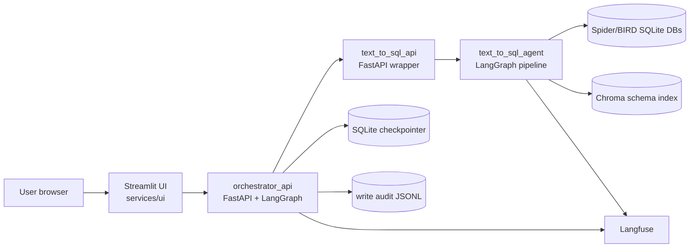

# Service Architecture

This document describes the service layer around the research Text-to-SQL
pipeline: UI, APIs, session memory, persistence, and observability storage.
The core model architecture is documented separately in `docs/ARCHITECTURE.md`.

## High-Level Layout

The system is split into three user-facing services:



- `services/ui/` is the browser-facing Streamlit SQL workbench.
- `services/orchestrator_api/` is the conversational agent API.
- `services/text_to_sql_api/` is a stateless HTTP wrapper over the core
  Text-to-SQL pipeline.
- `text_to_sql_agent/` and `orchestrator_agent/` remain reusable Python
  libraries; FastAPI only adapts them to HTTP.

## Runtime Services

### Streamlit UI

The UI runs on port `8501` in Docker Compose.

Responsibilities:

- Maintains the browser workbench: chat sidebar, editable SQL editor, result
  table, and hidden run inspector.
- Sends every chat turn to `orchestrator_api` via `POST /chat`.
- Reads session snapshots from `GET /sessions/{session_id}`.
- Reads database catalog/schema directly from `text_to_sql_api` for the DB
  browser.
- Persists `session_id` in the URL query parameter so a user can reload the
  browser and continue the same conversation.

The UI does not execute SQL directly. SQL execution still goes through the
orchestrator so guardrails, session history, and audit behavior stay centralized.

### Orchestrator API

The orchestrator runs on port `8002`.

Responsibilities:

- Exposes conversational endpoints:
  - `POST /chat`
  - `GET /sessions/{session_id}`
  - `DELETE /sessions/{session_id}`
- Runs a LangGraph agent loop: `agent -> tools -> agent`.
- Stores session state through a LangGraph checkpointer.
- Calls `text_to_sql_api` as a downstream tool service.
- Owns user-facing guardrails such as write confirmation and audit logging.

The orchestrator tools are grouped into:

- Core: `run_text_to_sql`, `execute_sql`, `explain_sql`
- Discovery: `list_databases`, `describe_database`, `switch_database`,
  `sample_table`, `search_table_values`
- SQL editing/history: `fix_sql`, `modify_sql`, `list_recent`, `rerun`
- Result UX: `summarize_results`, `export_results`
- Write guardrails: `propose_write_sql`, `confirm_write_sql`,
  `cancel_pending_confirmation`

### Text-to-SQL API

The Text-to-SQL API runs on port `8001`.

Responsibilities:

- Exposes the research pipeline over HTTP:
  - `POST /run`
  - `POST /execute`
  - `POST /refine`
  - `POST /modify`
  - `POST /explain`
  - `GET /databases`
  - `GET /databases/{db_id}/schema`
- Enforces read-only execution on `/execute`.
- Runs the core LangGraph Text-to-SQL pipeline:
  `selector -> value_linker -> query_sketcher -> generator -> execution_filter -> voting/judge -> refiner`.
- Returns compact metadata for the UI: SQL, preview rows, stage status,
  latency, cost, warnings, selected tables, query sketch, and Langfuse trace URL.

## Session Memory

Conversation memory is owned by `orchestrator_api`.

The LangGraph state lives in `orchestrator_agent/state.py` and includes:

- `messages`: full conversation history, appended via LangGraph `add_messages`
- `session_id`, `user_id`
- `active_db_id`
- `last_sql`
- latest result preview: `last_rows_preview`, `last_rows_columns`,
  `last_row_count`
- `last_result_export`
- `last_run_meta`: pipeline trace/cost/stage metadata for the latest `/run`
- `sql_history`: capped history of produced/executed SQL statements
- `pending_confirmation`: stored write/DDL request waiting for explicit user
  confirmation

The checkpointer backend is selected by `ORCH_CHECKPOINTER_BACKEND`.
Currently:

- `sqlite` is implemented and used by default.
- `postgres` is reserved as a future production backend.

In Docker Compose, the SQLite checkpointer is stored at:

```text
/app/.cache/orchestrator/sessions.sqlite
```

The host mount is:

```text
./.cache:/app/.cache
```

Therefore session memory survives normal container restarts as long as the
host `.cache/` directory is preserved. Users resume a session by keeping the
same `session_id`; the UI also mirrors it into the URL.

## Persistent Storage

### User Session Store

- Path in container: `/app/.cache/orchestrator/sessions.sqlite`
- Host path: `./.cache/orchestrator/sessions.sqlite`
- Owner: `orchestrator_api`
- Purpose: LangGraph checkpoints for multi-turn conversations.

### Write Audit Log

- Path in container: `/app/.cache/orchestrator/writes.jsonl`
- Config: `ORCH_AUDIT_LOG_PATH`
- Owner: `orchestrator_api`
- Purpose: append-only record of confirmed write/DDL executions.

Each audit row includes timestamp, `session_id`, `user_id`, `db_id`, SQL,
success flag, row count/error, and tool call id. Audit logging is intentionally
separate from session memory so write events are not lost when a session is
reset.

### Chroma Schema Index

- Path in container: `/app/.cache/chroma`
- Config: `CHROMA_PERSIST_DIRECTORY`
- Owner: `text_to_sql_api` / `text_to_sql_agent`
- Purpose: vector retrieval over schema table documents.

The Chroma collection is embedding-aware. Changing generator or judge models
does not invalidate it; changing the embedding model must use a separate
collection namespace.

### Dataset Databases

- Host mount: `./databases:/app/databases:ro`
- Used paths:
  - `/app/databases/spider`
  - `/app/databases/bird`
  - `/app/databases/bird_mini`

The benchmark SQLite databases are mounted read-only at the container level.
SQL execution is additionally guarded at the API layer.

### Langfuse Observability Stack

Docker Compose also runs a self-hosted Langfuse stack:

- `langfuse-web`
- `langfuse-worker`
- `langfuse-postgres`
- `langfuse-clickhouse`
- `langfuse-redis`
- `langfuse-minio`

Langfuse stores traces, spans/generations, token usage, costs, and metadata.
This storage is independent of orchestrator session memory. The UI receives
browser-facing trace URLs and exposes them through the run inspector.

## Request Flow

### Natural-Language Question

1. User writes a message in the Streamlit chat.
2. UI sends `POST /chat` with `session_id`, `user_id`, message, and optional
   active database.
3. Orchestrator loads previous state from the checkpointer.
4. Agent decides which tool to call.
5. For a full Text-to-SQL request, orchestrator calls `text_to_sql_api /run`.
6. `text_to_sql_api` runs the core pipeline, executes the best SQL candidate,
   and returns SQL, rows, metadata, and trace link.
7. Orchestrator updates `last_sql`, result preview, `sql_history`, and
   `last_run_meta`.
8. UI reloads `/sessions/{session_id}` and displays chat, editable SQL, table
   preview, and run inspector metadata.

### Manual SQL Execution

1. User edits SQL in the UI workbench.
2. UI sends a chat message asking the orchestrator to execute that SQL.
3. Orchestrator calls the `execute_sql` tool.
4. `text_to_sql_api /execute` validates read-only SQL before execution.
5. Result preview and SQL history are stored back into the same session.

### Session Resume

1. UI stores `session_id` in the browser URL as `?session_id=...`.
2. On reload, UI reuses that `session_id`.
3. UI calls `/sessions/{session_id}`.
4. Orchestrator restores the LangGraph checkpoint from SQLite.
5. Chat, `last_sql`, result preview, and history become available again.

## Multi-User Model

The service supports multiple users through session isolation:

- `session_id` is the LangGraph `thread_id`.
- Each session has independent message history, active DB, last SQL, result
  preview, and pending confirmation.
- `user_id` is propagated through API requests and audit events.

The current deployment uses a single `orchestrator_api` process with a
file-backed SQLite checkpointer. This is enough for a local/demo multi-user
scenario with several independent sessions. A production horizontally scaled
deployment should replace the SQLite checkpointer with a Postgres checkpointer.

## Guardrails

Current service guardrails:

- `/execute` rejects non-read-only SQL.
- Write/DDL flow is explicit: propose first, execute only after user
  confirmation.
- Confirmed writes are appended to `writes.jsonl`.
- Database-derived row previews are wrapped as untrusted data in tool output.
- DB browser uses schema/catalog endpoints rather than arbitrary user-provided
  filesystem paths.

## What Is Not In The Current Service

The following are intentionally not part of the current minimal defense-ready
service:

- Celery/Redis task queue for chat requests
- Postgres checkpointer for orchestrator memory
- Kubernetes/Helm deployment
- Redis response cache
- Full authentication/multi-tenant authorization

These are reasonable production extensions, but the current service focuses on
a stable demo: persisted sessions, isolated users, guardrailed SQL execution,
traceability, and an inspectable SQL workbench.

